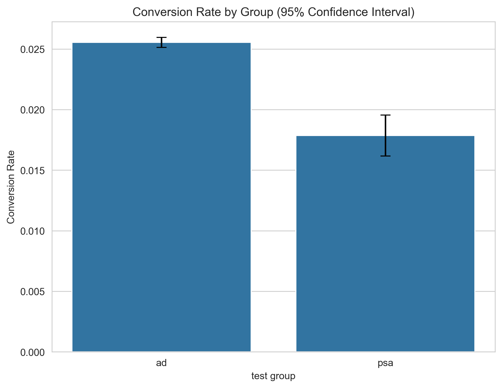
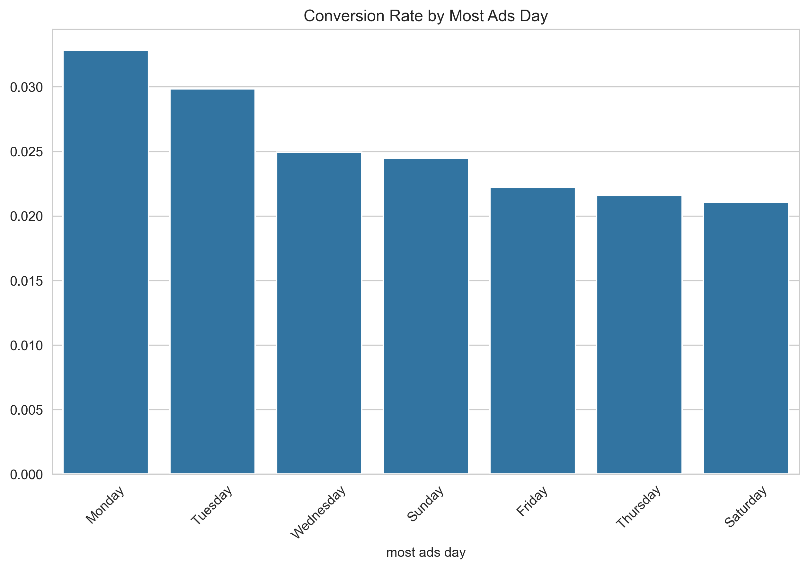
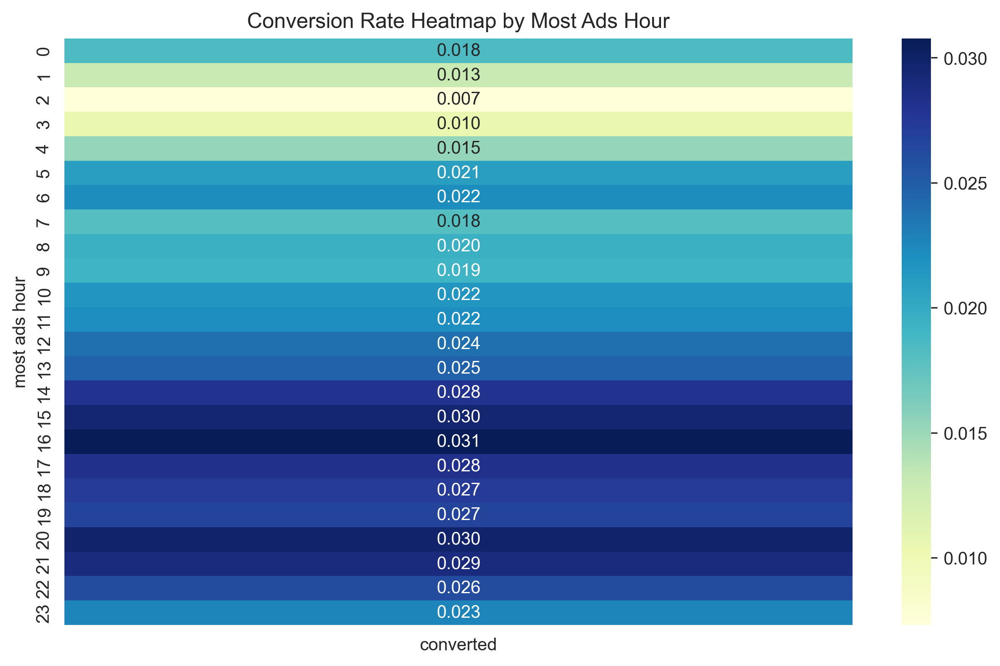
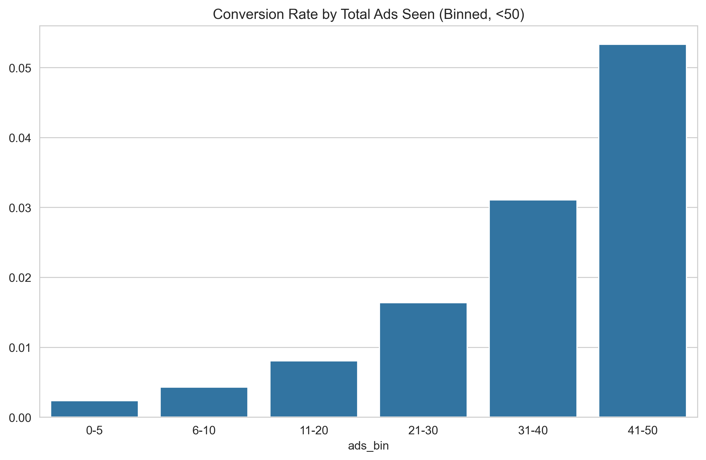

# A/B Testing: Effectiveness of Advertisement vs PSA in Driving Conversions

## Overview

An A/B testing analysis using a marketing dataset (~590k users) to answer:  
**Is a commercial advertisement ('ad') more effective than a Public Service Announcement ('psa') in driving conversions?**

This project showcases Product Analyst skills: experiment design, statistical testing, visualization, power analysis, and actionable business recommendations.

**Business Question**  
Does the 'ad' variant provide a significant lift? How reliable is the result (power)? What is the estimated revenue impact if rolled out?

**Dataset**

- Source: Kaggle - Marketing A/B Testing
- Key columns: test group ('ad'/'psa'), converted (0/1), total ads, most ads day/hour
- Link: [kaggle.com/datasets/faviovaz/marketing-ab-testing](https://www.kaggle.com/datasets/faviovaz/marketing-ab-testing)

## Key Findings

- Conversion rate: 'ad' ~2.55% vs 'psa' ~1.79% → **relative lift ~42%**
- Statistically significant (p < 0.01 via Chi-Square)
- Effect size: Small (Cohen’s h ≈ 0.036), but **post-hoc power ~0.99** (well-powered due to large sample size) → hasil sangat reliable
- Peak timing: Fridays and hours 15:00–20:00 show highest conversion
- Frequency: Conversion rises with more ads up to ~20–30, then diminishing returns (plateau/over-exposure risk)

## Tech Stack & Tools

- Python 3.10 (Conda env `ab_testing`)
- Core libraries: pandas, numpy, scipy, statsmodels, matplotlib, seaborn, jupyter
- Tests: Chi-Square (primary), ANOVA, post-hoc power analysis (TTestIndPower)
- Visualization: Bar plots with CI, heatmaps, binned frequency charts

## Folder Structure

```text
ab-testing-marketing-campaign/          # Nama repo/root project
├── data/
│   ├── raw/
│   │   └── marketing_AB.csv            # Dataset asli dari Kaggle
│   └── processed/                      # (opsional: data yang sudah di-clean)
├── notebooks/
│   └── ab_testing_analysis.ipynb       # Notebook utama: analisis lengkap + power post-hoc
├── images/                             # Exported charts dari notebook
├── environment.yml                     # Spec Conda environment (untuk recreate env)
├── .gitignore                          # Ignore files sampah
├── requirements.txt                    # Backup pip dependencies
└── README.md                           # Dokumen ini
```

## Setup & Reproduce

1. Clone this repo.
2. Install Miniconda/Anaconda.
3. Create environment
4. Activate denvironment
5. Open VSC
6. Open Notebook `notebooks/ab_testing_analysis.ipynb`
7. Run all cells (pastikan dataset ada di `data/raw/marketing_AB.csv`).

### Results Highlights









## Recommendation (Product Perspective)

- **Roll out 'ad' variant fully**
  Lift ~42% (1.79% → 2.55%), p < 0.01, **post-hoc power ~0.99** → decision sangat reliable.
  Estimated impact (hypothetical): ~Rp 760 juta/month revenue lift (asumsi 1 juta users/mo, AOV Rp 100k).

- **Optimize scheduling**
  Prioritaskan **Jumat** dan jam **15:00–20:00** (dari heatmap & ANOVA).

- **Frequency capping**
  Conversion naik sampai ~20–30 ads/user, lalu flattening.
  Set cap max 30 ads/user/minggu untuk hindari ad fatigue & potensi penurunan engagement jangka panjang.

- **Next experiments**
- Segmentasi: Test lift di new vs returning users
- Variant testing: Creative ad berbeda atau CTA variasi
- Monitor post-rollout: Retention, LTV, churn rate

**Kesimpulan singkat**: 'ad' jelas winner → roll out segera dengan scheduling & frequency optimization untuk maksimalkan ROI.

## Project Status

- [x] Data loading & cleaning
- [x] EDA & group comparison
- [x] Statistical tests (Chi-Square, ANOVA)
- [x] Post-hoc power analysis
- [x] Visualizations
- [x] Business impact estimation
- [x] README polish

Feel free to fork / star! 🚀
